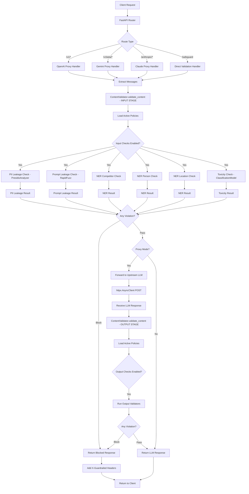
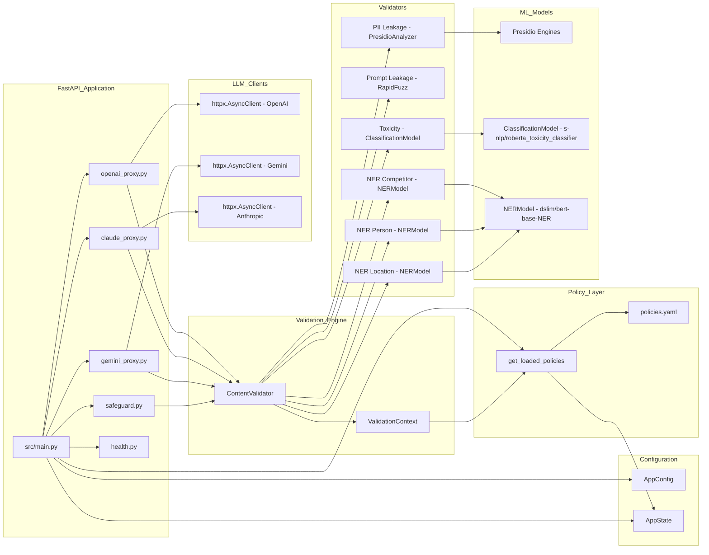

# Architecture

## Overview

Guardrailed is a FastAPI service that intercepts requests between client applications and LLM providers, applying policy-based validation to both user inputs and model outputs. The service operates in two modes: as a transparent proxy for OpenAI, Gemini, and Anthropic API calls, or as a direct validation endpoint for custom workflows. All validation logic executes locally within your infrastructure using machine learning models for PII detection, NER-based entity recognition, toxicity classification, and fuzzy matching for secret detection.

## Request flow

## Component map

## Endpoint reference

| Method | Path | Description | Upstream |
|--------|------|-------------|----------|
| GET | /health | Health check endpoint returns service status | None |
| POST | /safeguard | Direct content validation endpoint | None |
| POST | /v1/chat/completions | OpenAI chat completions proxy | OpenAI |
| POST | /v1beta/models/{model}:generateContent | Gemini content generation proxy | Gemini |
| POST | /anthropic/v1/messages | Anthropic Claude messages proxy | Anthropic |

## Policy engine internals

The policy engine filters and applies validation rules through ContentValidator in the domain layer. When processing a message, the engine calls `_get_active_policies_for_role()` which filters the loaded policy list by the `is_user_policy` flag for input validation and `is_llm_policy` flag for output validation. Active policies are grouped by their `id` field into PolicyType enumerations, then dispatched to corresponding validator functions.

Each policy type invokes a specific validator with the policy's configured threshold and message context. PII leakage checks use Presidio's analyzer with spaCy and Transformers backends to detect entities like email addresses and credit card numbers. Prompt leakage uses RapidFuzz for fuzzy string matching against protected keyword lists. The three NER-based checks (competitors, persons, locations) share a single NERModel wrapper around Hugging Face's bert-base-NER, while the toxicity check uses a separate ClassificationModel wrapper around the roberta_toxicity_classifier.

When a violation is detected, the engine returns a Status object containing a SafetyCode, action type, and message. The OVERRIDE action (action: 0) causes the router to return a blocked response with X-Guardrailed headers indicating the safety code and action taken. The OBSERVE action (action: 1) logs the violation but allows the request to proceed unchanged. The REDACT action (action: 2) modifies the content to remove detected violations, though this is currently only supported in the direct validation endpoint. For all violation types, the engine returns consistent Status and SafetyCode objects that routers use to construct appropriate HTTP responses.
